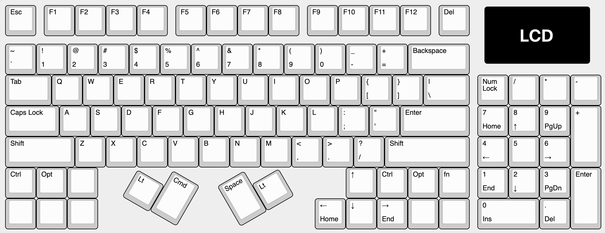
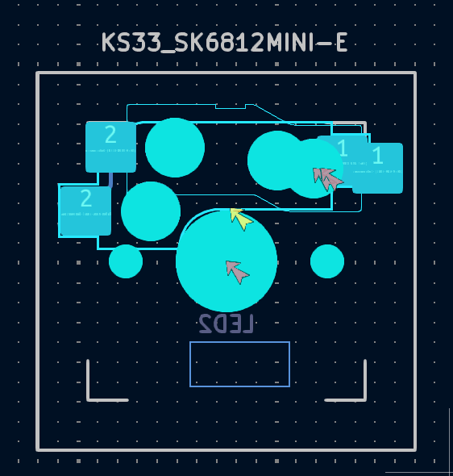

## Layout

### Features
- Multiple thumb keys, a single space is a waste of space
- Arrow keys nested under my right palm
- Dedicated numpad
- F13 spaced function row
- LCD in the top right
## Footprint
For this design, I decided I wanted to support more than one kind of switch:
- Gateron KS-33 (low profile Gateron switches v2)
- Cherry MX and Gateron Normal profile
After chatting with some folks on Discord, this is possible to support multiple types of switch with seemingly incompatible footprints by overlapping either the different switches/footprints or combining the two footprints into a single one like this:

In this example, these are 2 different `hotswap` footprints that I've manually combined into a single footprint `KS-33_MX_HOTSWAP`.
- Cherry MX (which Gateron Normal Profile switches fit into)
- Gateron KS-33 Low Profile Switches

>**Note:** These switches, while now technically supported by the PCB, will not be hot swappable for 2 reasons:
>- The HotSwap sockets can't **both** be installed at once, the maker will need to chose
>- The Case/Plate design will be different. The KS-33's, being low-profile, will have a different distance between plate and PCB than the normal profile MX and Gateron Switches

Couple things to note about doing this:
- Will require a plate to keep the switch steady since you're overlapping several of the post holes. 
- Might get some DRC errors, need to manually override them.
- Manu might not be able to make them depending on how you overlap switches
- Some switch types are NOT compatible, the pads and holes might overlap too much.

## Gasket Mount
- Should have about 1mm of space between the PCB and the plate sides
- The gasket mount is basically a method of suspending the plate on gaskets or foam pads so that it has some bounce to it as the user is typing.
- The Megalodon macropad I have is gasket mounted so that could be a good resource

## Plate to PCB
For normal profile switches, the distance from the bottom of the plate to the top of the PCB is 5mm
For the 