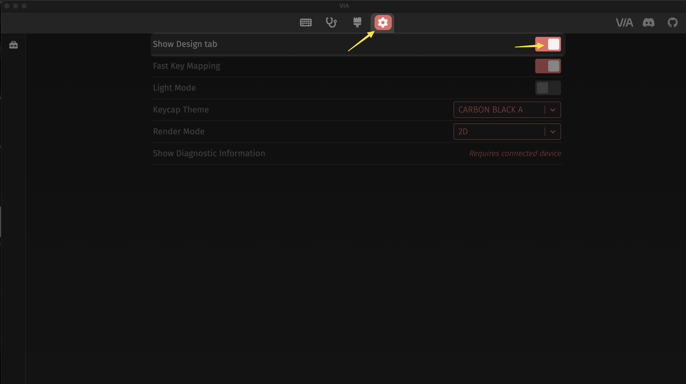

Via can be a tricky beast when it comes to custom keyboards since they aren't a part of the official VIA release (most likely).

However, VIA does provide a work around for this, but it can be a little finicky.

# VIA JSON
 There is a JSON file in my QMK Userspace for this keyboard. You'll need to `download it` in order to update your keyboard in VIA.
 
 - [QMK Userspace VIA JSON](https://github.com/modern-hobbyist/qmk_userspace/blob/main/keyboards/aesir/mist/keymaps/via-mist.json)

# Import JSON to VIA
- Open VIA
- Navigate to the `Settings` tab and enable `Show Design Tab`
  
- Plug in your keyboard
- Go to the Design Tab and click `Load`
- Select the JSON file linked above
- Navigate back to the `Configure` tab

> VIA will "save" the JSON file in a list in the design tab, but in my experience you have to load the JSON through the file-picker in order for it to properly appear in the `Configure` tab.